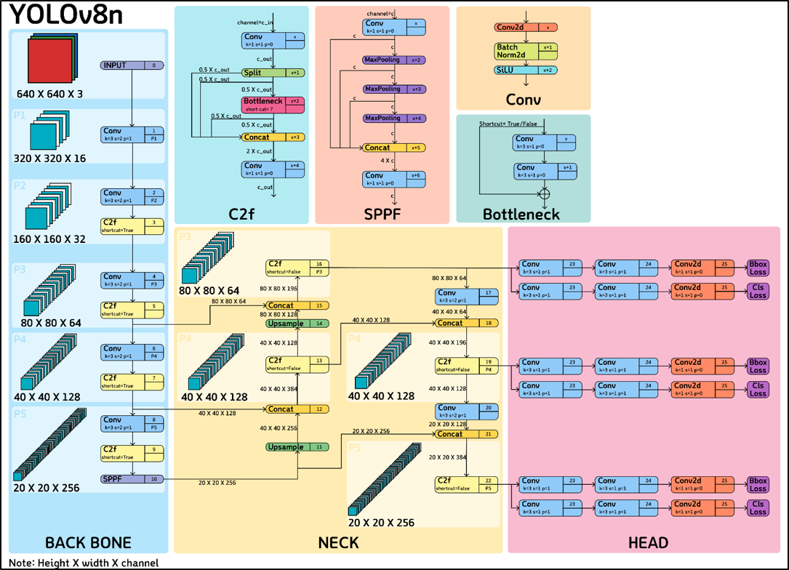
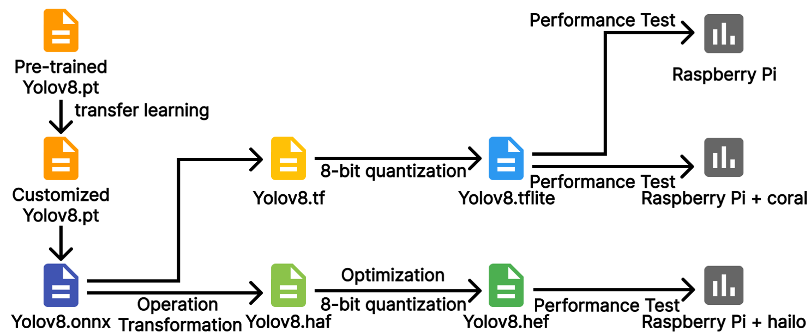
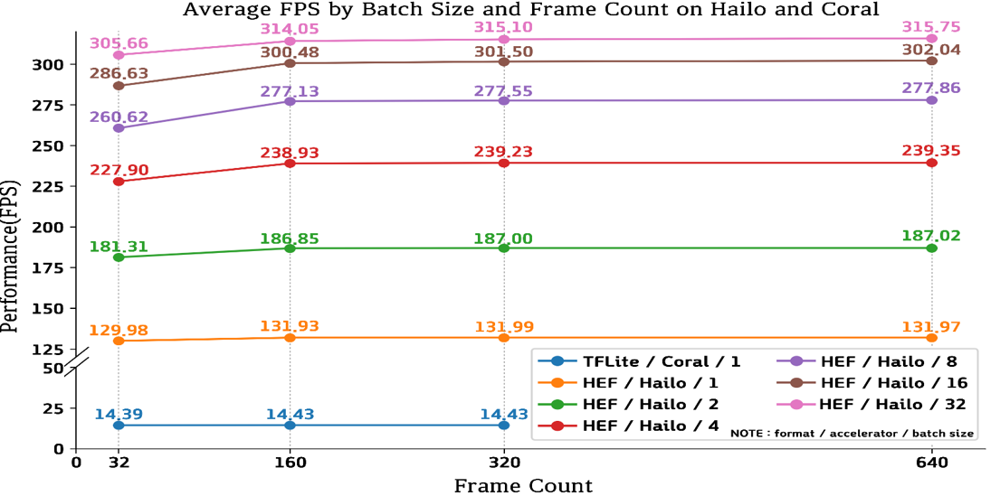

## Edge Computer(Raspberry Pi5) 환경에서 YOLOv8 모델에 대한 AI 가속기 성능 비교에 관한 연구

### 개요 (Overview)

본 저장소는 Google Coral USB Edge TPU와 Hailo-8 AI 가속기의 객체 탐지 성능을 비교하기 위한 실험 코드 및 분석 결과를 포함합니다.
YOLOv8n 기반의 모델을 사용하여 두 엣지 디바이스에서의 처리 속도(FPS), 정확도(mAP) 등을 정량적으로 분석하였습니다.

---

### 프로젝트 구성 (Project Structure)

```
📁 scripts/              # 추론 실행 및 측정 스크립트
📁 results/              # 시각화 자료
📁 README.md             # 이 문서
📁 requirement.txt
```

---

###  실험 환경 (Environment)

| 항목           | Raspberry Pi Only        | Coral USB TPU            | Hailo-8 (M.2 HAT+)       |
| ------------ | ------------------------ | ------------------------ | ------------------------ |
| Device       | Raspberry Pi 5           | Raspberry Pi 5           | Raspberry Pi 5           |
| Accelerator  | 없음                       | USB Edge TPU             | Hailo M.2 HAT+           |
| OS           | Raspberry Pi OS (64-bit) | Raspberry Pi OS (64-bit) | Raspberry Pi OS (64-bit) |
| Python       | 3.9                      | 3.9                      | 3.9                      |
| Model Format | int8 TFLite              | int8 TFLite (EdgeTPU)    | 8bit HEF (Hailo-8)       |

---

###  사용한 모델 (Models)

* **객체 탐지 모델**: YOLOv8n

* **형식**:

  * Coral: `YOLOv8n_int8_edgetpu.tflite`
  * Hailo: `YOLOv8n_8bit_quantized.hef`
  * Pi5 단독 실행: `YOLOv8n_float32.tflite`


---

### 성능 비교 (Performance Comparison)

| 항목               | Raspberry Pi Only | Coral TPU             | Hailo-8            |
| ---------------- | ----------------- | --------------------- | ------------------ |
| Model Format     | int8 TFLite       | int8 TFLite (EdgeTPU) | 8bit HEF (Hailo-8) |
| mAP\@50-95       | 0.715             | 0.715                 | 0.777              |
| Video Avg FPS    | 13.29 FPS         | 27.6 FPS              | 99.7 FPS           |
| Static Frame FPS | 6.64 FPS          | 14.44 FPS             | 131.93 FPS         |

> ※ video avg fps: 90초짜리 100fps 영상 10회 실행 평균

> ※ static frame avg fps: 100개의 정지 이미지 × 150 frame 기준 계산

### Batch Size 변화에 따른 Hailo의 fps변화 (Performance Comparison)


---

### 데이터셋 (Dataset)

* AI Hub: "자동차 차종/연식/번호판 인식용 영상"
* 사용량: 학습(700장), 검증(200장), 테스트(100장)
* 출처: [aihub.or.kr](https://aihub.or.kr)


---

### 결론 (Conclusion)

본 실험을 통해 Raspberry Pi 단독 실행과 Coral USB TPU, Hailo-8 가속기의 성능 차이를 비교할 수 있었습니다. 정확도(mAP)는 세 환경 모두 유사한 수준이었으나, 처리 속도에서는 다음과 같은 경향을 보였습니다:

* Raspberry Pi 단독 실행은 실시간 처리에는 부적합한 낮은 FPS를 보였습니다.
* Coral USB TPU는 성능 향상이 있었으나, Hailo-8 대비 상대적으로 낮은 처리 속도를 기록했습니다.
* Hailo-8은 가장 높은 FPS 성능을 기록하며, 실시간 엣지 추론에 가장 적합한 환경으로 확인되었습니다.

---

### 라이선스 (License)

본 프로젝트는 [MIT License](./LICENSE)를 따릅니다.
